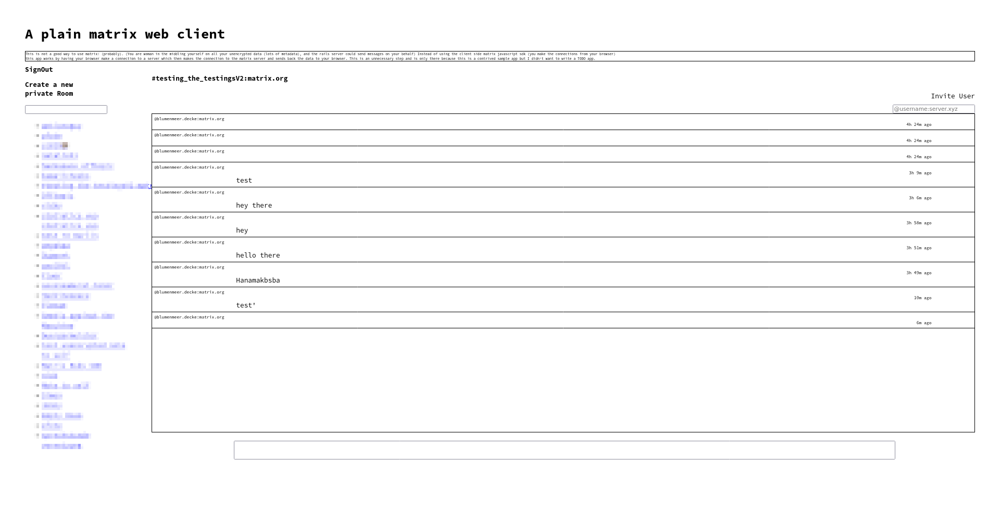

# README

## NOTICE 

This is not a good way to use matrix! (probably). 
Instead of using the client side matrix javascript sdk 
(you make the connections from your browser) 
this app works by having your browser make a connection to a server 
which then makes the connection to the matrix server and sends 
back the data to your browser. 
This is an unnecessary step and is only there because this is a contrived 
sample app but I didn't want to write a TODO app.    

## Project Notes

**There are some open Todos (creating rooms and invites, an error component, better usage of the Loading Component and some cleaning), monday morning was 
my deadline though**
- i'm not happy with this representing my rails skills, i just got really 
  distracted on the matrix sdk and bugs in it, e2e, and learning react

- This is for me testing out and learning React on Rails  
  Notes i write can be found in `dev_doc/`
- The rails part is really not great and is just very hacked 
  together (i would want to split things into a user, rooms, and session controller).
  - There is some general clean up necessary ( i put this together over the weekend-ish ) 
  - Some controller actions are kind of redundant (triggerering `client.sync`   
    way to much ) 
- The are no tests which is upsetting, but yeah i wanted to hand in the     
  job application this is for.

### Design
- This is obviously super contrived. There is no reason to man in the middle   
  yourself and a proper client should just use the matrix javascript sdk, 
  there is also a react one. 
- I decided that i will write this in react on rails and thus i wrote this 
  silly thing where this is provides a second server (the rails part) and a 
  client to that new server (the react part)

The general setup is that: 
1. the User makes an http request to the Rails Server.
2. the rails server auths and syncs the user. 
3. the rails server creates a background job with an eventlistener on the 
  - to keep the reference to the user state and jobs there is some Redis Caching 
    ( i didnt want to use a database )
    MatrixSdk::Client that sends messages via ActionCable to the Client 
4. The client processes the events (appending to the MatrixEvents)
5. For sending messages or signing out the client just makes simple post requests

## Rails Generated

* Ruby version
3.2.1

* System dependencies
- redis i and the react on rails deps

- make sure you have a file `tmp/caching-dev.txt` 
  so that caching is enabled. 

* Database creation 
  not really using one db:setup is Fine 

* How to run the test suite 
  o.o this was a rush job

* Services (job queues, cache servers, search engines, etc.)
  Sidekiq, ActionCable, Redis

* Deployment instructions
  `./render_build.sh`
